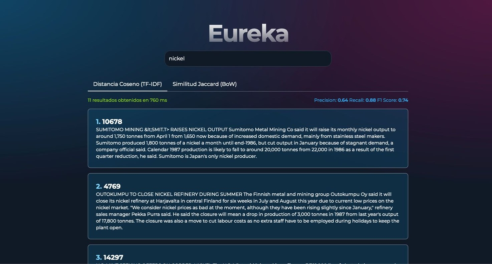

# Eureka

Proyecto bimestral para la materia Recuperación de Información - 2024A EPN

El proyecto consiste en un sistema de recuperación de información que utiliza métodos de indexación como TF-IDF y Bag of Words junto a algoritmos de búsqueda como Cosine Similarity y Jaccard Similarity para recuperar y rankear los documentos relevantes a una consulta ingresada por el usuario.

El backend fue desarrollado con FastAPI

## Estructura

El proyecto está dividido en dos ramas principales: `front-end` y `back-end`.

### Frontend

En la rama `front-end` se encuentra el código del frontend del proyecto, desarrollado con [Sveltekit](https://kit.svelte.dev/)

El frontend consiste en una interfaz web que permite al usuario ingresar una consulta y visualizar los documentos recuperados por el sistema junto a los scores de relevancia respectivos según el algoritmo utilizado.

Screenshot de la interfaz:

### Backend

En la rama `back-end` se encuentra el código del backend del proyecto, desarrollado con [FastAPI](https://fastapi.tiangolo.com/)

El backend consiste en un servidor que recibe las consultas del usuario, procesa la consulta y retorna los documentos recuperados junto a los scores de relevancia respectivos.

En el backend se implementan los algoritmos de indexación y búsqueda para la recuperación de los documentos.

## Integrantes

- [@Cheveniko](https://github.com/Cheveniko)
- [@Pinkylml](https://github.com/Pinkylml)
- [@Afkerian](https://github.com/Afkerian)
